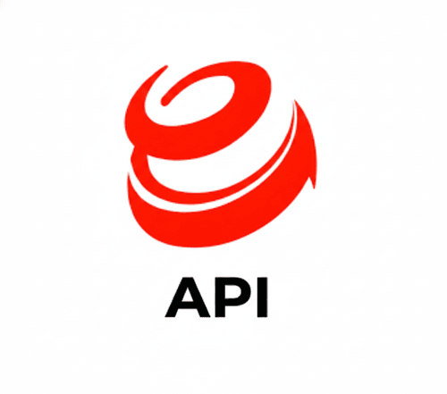
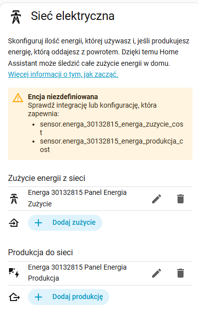
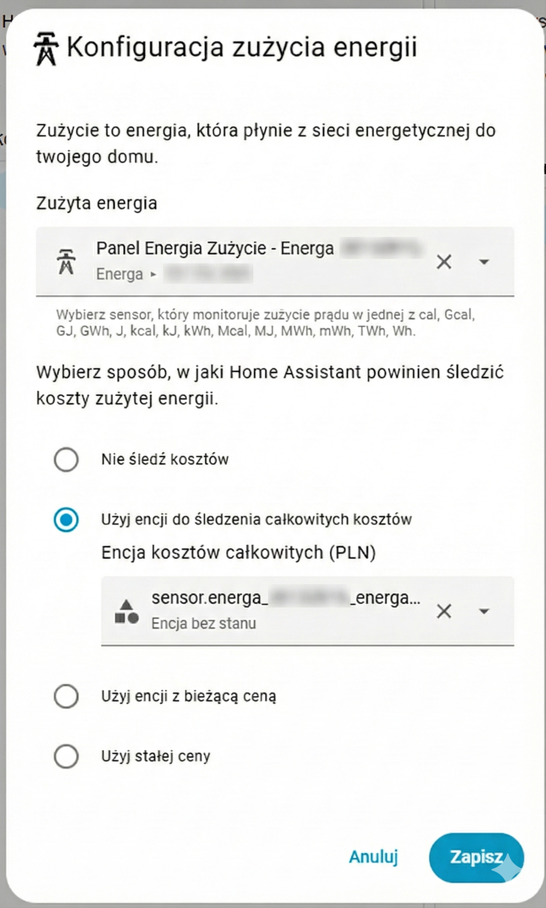

  

<h1 align="center">Energa My Meter API Integration for Home Assistant</h1>

🇵🇱 This integration is designed for customers of **Energa Operator** — a regional electricity distributor serving **northern Poland** (Pomorze, Warmia-Mazury, Kujawsko-Pomorskie).

A robust integration for **Energa Operator** in Home Assistant that communicates directly with the **native REST API** — **not web scraping**. It retrieves data from the "Mój Licznik" portal and integrates seamlessly with the **Energy Dashboard**. Features **self-healing history import**, **automatic cost calculation**, and reliable cumulative statistics.

> [!TIP]
> For technical details about the API endpoints, see [ENERGA_API_REFERENCE.md](docs/ENERGA_API_REFERENCE.md).

---

## ✨ Key Features

*   **📡 Native API:** Direct communication with Energa's REST API — lightweight JSON responses, stable interface.
*   **📊 Energy Dashboard Ready:** Dedicated sensors (`Panel Energia`) designed specifically for correct statistics.
*   **💰 Automatic Cost Calculation:** Calculates energy costs in PLN based on configured prices.
*   **🛡️ Reliable Statistics:** Spike-free Energy Dashboard — data is always consistent.
*   **⚡ Hourly Granularity:** Precise hourly consumption/production tracking.
*   **🔌 Multi-Zone Tariffs (G12/G12w):** Automatic detection of two-zone meters with separate peak/off-peak tracking for both import and export.
*   **⚖️ Prosumer Balance:** Tracks net billing balance with configurable coefficient (default 0.8).
*   **🛠️ Auto-Repair (Self-Healing):** The "Download History" feature automatically fixes gaps and corrupted data.
*   **🔍 Auto-Detect:** Automatically identifies consumption and production meters.

---

## 📦 Installation

### HACS (Recommended)
1.  Open **HACS** → **Integrations**.
2.  Search for **Energa My Meter**.
3.  Click **Install** and restart Home Assistant.

Manual Installation

1. Download the latest release from [GitHub Releases](https://github.com/ergo5/hass-energa-my-meter-api/releases)
2. Copy the `custom_components/energa_mobile` folder to your `config/custom_components/` directory
3. Restart Home Assistant

### Configuration
1.  Go to **Settings** → **Devices & Services**.
2.  Click **Add Integration** → search for **Energa My Meter**.
3.  Log in with your **Energa Mój Licznik** credentials.

---

## 💰 Cost Calculation

The integration **automatically calculates energy costs** and displays them in the Energy Dashboard in **PLN (złoty)**.

**How it works:**
- When you configure energy prices (see below), the integration creates cost sensors
- Cost sensors: `*_zuzycie_cost` (consumption), `*_produkcja_cost` (production)
- These sensors work seamlessly with the Energy Dashboard to show costs alongside energy usage

> [!NOTE]
> **Two-zone tariffs** (G12, G12w, G12r) are fully supported with separate zone pricing. Three-zone tariffs (G13) are not currently supported.

---

## ⚙️ Price Configuration

To enable cost calculation, you must configure energy prices:

1. Go to **Settings** → **Devices & Services** → **Energa My Meter**
2. Click **Configure** (three dots menu)
3. Select **"Set Energy Prices"** (Ustaw Ceny Energii)
4. Enter your prices:

| Tariff | Field | Default (PLN/kWh) |
|---|---|---|
| **G11** (single-zone) | Import | 1.188 |
| **G12/G12w** zone 1 (peak) | Import Zone 1 | 1.2453 |
| **G12/G12w** zone 2 (off-peak) | Import Zone 2 | 0.5955 |
| All tariffs | Export | 0.95 |
| Prosumer accounts | Prosumer coefficient | 0.8 (80%) |

> [!TIP]
> The options form automatically adapts to your tariff — two-zone meters (G12/G12w) will see zone-specific fields, single-zone meters (G11) will see a single import price.

---

## 📡 Available Sensors

The integration creates multiple sensors organized by function:

### Energy Dashboard Sensors (Panel Energia)
**Use these for the Energy Dashboard:**

> [!NOTE]
> Panel Energia sensors show **"unknown"** in the entity list — this is normal. Their data appears only in the **Energy Dashboard**, not as a live state.

#### Single-Zone (G11)

| Sensor Name | Description | Purpose |
|-------------|-------------|---------|
| `Panel Energia Zużycie` | Cumulative consumption | Grid Consumption in Dashboard |
| `Panel Energia Produkcja` | Cumulative production | Return to Grid in Dashboard |
| `Panel Energia Zużycie Cost` | Consumption cost (PLN) | Auto-created for cost tracking |
| `Panel Energia Produkcja Cost` | Production compensation (PLN) | Auto-created for cost tracking |

#### Multi-Zone (G12/G12w) — auto-created for two-zone tariffs

| Sensor Name | Description | Purpose |
|-------------|-------------|---------|
| `Panel Energia Strefa 1` | Peak zone consumption | Zone 1 import in Dashboard |
| `Panel Energia Strefa 2` | Off-peak zone consumption | Zone 2 import in Dashboard |
| `Panel Energia Strefa 1 Cost` | Peak zone cost (PLN) | Zone 1 cost tracking |
| `Panel Energia Strefa 2 Cost` | Off-peak zone cost (PLN) | Zone 2 cost tracking |
| `Panel Energia Produkcja Strefa 1` | Peak zone production | Zone 1 export in Dashboard |
| `Panel Energia Produkcja Strefa 2` | Off-peak zone production | Zone 2 export in Dashboard |
| `Panel Energia Produkcja Strefa 1 Cost` | Peak zone compensation (PLN) | Zone 1 export cost |
| `Panel Energia Produkcja Strefa 2 Cost` | Off-peak zone compensation (PLN) | Zone 2 export cost |

### Daily Sensors
| Sensor Name | Description |
|-------------|-------------|
| `Zużycie Dziś` | Today's consumption (kWh) |
| `Produkcja Dziś` | Today's production (kWh) |

### Meter State Sensors
| Sensor Name | Description |
|-------------|-------------|
| `Stan Licznika Import` | Total meter reading (consumption) |
| `Stan Licznika Export` | Total meter reading (production) |

### Metadata Sensors
| Sensor Name | Description |
|-------------|-------------|
| `Adres` | Installation address |
| `Taryfa` | Tariff type (e.g., G11, G12, G12w) |
| `PPE` | PPE identification number |
| `Numer Licznika` | Meter serial number |
| `Data Aktywacji` | Mój Licznik app activation date* |

*Only available for prosumer accounts

### Prosumer Sensors (auto-created for prosumer accounts)
| Sensor Name | Description |
|-------------|-------------|
| `Bilans Prosumencki` | Net billing balance (export × coeff − import) in kWh |

---

## 📊 Energy Dashboard Setup

To see correctly calculated statistics **and costs** in the Energy Dashboard, you MUST select the specific sensors labeled **"Panel Energia"**.

### Step 1: Configure Grid Consumption

*Example configuration showing Panel Energia sensors with cost tracking*

### Single-Zone Tariff (G11)

| Dashboard Section | Energy Sensor | Cost Sensor |
|:---|:---|:---|
| **Grid Consumption** (Pobór z sieci) | Panel Energia Zużycie | Panel Energia Zużycie Cost |
| **Return to Grid** (Oddawanie do sieci) | Panel Energia Produkcja | Panel Energia Produkcja Cost |

### Multi-Zone Tariff (G12 / G12w)

For two-zone tariffs, add **each zone separately**:

| Dashboard Section | Energy Sensor | Cost Sensor |
|:---|:---|:---|
| **Grid Consumption** (zone 1 — peak) | Panel Energia Strefa 1 | Panel Energia Strefa 1 Cost |
| **Grid Consumption** (zone 2 — off-peak) | Panel Energia Strefa 2 | Panel Energia Strefa 2 Cost |
| **Return to Grid** (zone 1 — peak) | Panel Energia Produkcja Strefa 1 | Panel Energia Produkcja Strefa 1 Cost |
| **Return to Grid** (zone 2 — off-peak) | Panel Energia Produkcja Strefa 2 | Panel Energia Produkcja Strefa 2 Cost |

### Step 2: Configure Cost Sensors

*Configure cost tracking by selecting the matching cost sensor*

When adding energy sources to the Energy Dashboard:
1. Select the **Panel Energia** sensor for energy tracking
2. In the **cost** field, select the corresponding `*_cost` sensor
3. The cost sensor **must match** the energy sensor (e.g., `zuzycie` with `zuzycie_cost`)

> [!IMPORTANT]
> **Do NOT use** `Zużycie Dziś`, `Produkcja Dziś`, or `Stan Licznika` sensors for the Energy Dashboard — only **Panel Energia** sensors produce correct statistics.

> [!NOTE]
> **"Entity Unavailable" (Encja niedostępna)?** This is **normal** for Panel Energia sensors. They work in background for the Energy Dashboard and don't have a live "state" to display. They will still work correctly.

---

## 📅 History Import & Repair

Use this feature if you have missing data OR if you see incorrect spikes in your Energy Dashboard.

1.  Go to **Settings** -> **Devices & Services** -> **Energa My Meter** -> **Configure**.
2.  Select **"Download History"** (Pobierz Historię Danych).
3.  Choose a **Start Date** (e.g., 30 days ago).
4.  Click **Submit**.

**How it works:** The integration downloads fresh data from Energa and calculates clean, continuous statistics based on your current meter reading. This effectively **overwrites** any corrupted historical data, including cost data.

*The process happens in the background. Check logs for progress.*

---

## ⚠️ Limitations

- **Supported Tariffs:** G11 (single-zone) and two-zone tariffs (G12, G12w, G12r) are fully supported. Three-zone tariffs (G13) are not supported — if you need G13, please [open an issue](https://github.com/ergo5/hass-energa-my-meter-api/issues).
- **PLN Currency:** Cost calculation is in Polish złoty (PLN) only.
- **Statistics Sensors:** Panel Energia sensors show as "unknown" or "unavailable" in entity lists (this is normal — they work in Energy Dashboard).
- **Hourly Granularity:** Statistics are hourly — no sub-hour precision.

---

## 🐛 Troubleshooting

### "Token expired" warnings in logs

This is **normal behavior**. The Energa API invalidates session tokens frequently. The integration automatically re-authenticates when this happens — no action needed.

If you see persistent **errors** (not warnings), try removing and re-adding the integration:
1. Go to **Settings** → **Devices & Services** → **Energa My Meter**
2. Click the **3 dots** → **Delete**
3. Add the integration again with your credentials

### Sensors "Panel Energia" Missing?

- Check the **Diagnostic** entities section
- Enable "Show disabled entities" in entity list

### Cost Not Showing in Energy Dashboard?

1. **Verify prices are configured:** Settings → Energa My Meter → Configure → Set Energy Prices
2. **Check cost sensors exist:** Look for `*_cost` sensors in entity list
3. **Ensure correct mapping:** Cost sensor must match energy sensor (e.g., `zuzycie` with `zuzycie_cost`)

### Data Not Appearing in Energy Dashboard?

Ensure you selected the correct **Panel Energia** sensors, not the "Daily" or "State" sensors. See [Energy Dashboard Setup](#-energy-dashboard-setup) above.

### About "Data Aktywacji" Sensor

This sensor shows the **activation date of the Mój Licznik mobile app**, not the contract signing date. It's only available for prosumer (producer-consumer) accounts and may not appear for regular consumer accounts.

---

## 📄 Changelog

See [CHANGELOG.md](CHANGELOG.md) for detailed version history.

---

### Disclaimer
This is a custom integration and is not affiliated with Energa Operator. Use at your own risk.
